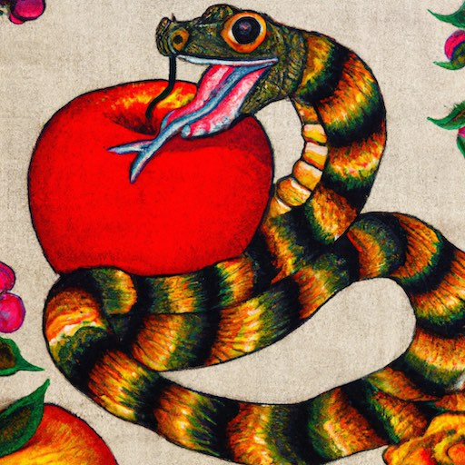
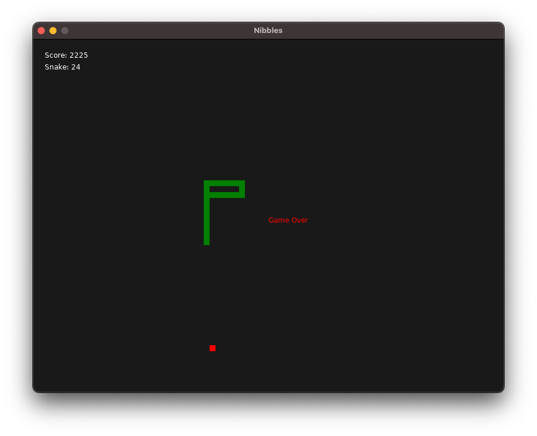

# ML Nibbles

The serpent, in its quest for sustenance, must navigate its path with great
care, avoiding collision with the boundaries of the enclosure or its own
elongated body. It is a dance of strategy and reflexes.

As the serpent consumes these ethereal morsels, it grows in length. With this
growth comes an increasing challenge, as the serpent must maneuver itself with
ever greater precision to avoid its own elongated form and the confines of its
quaintly rendered realm.

## Requirements

* [LunarML](https://github.com/minoki/LunarML)
* [LÖVE](https://love2d.org)

## Building

    $ make

## Running

    $ love .
